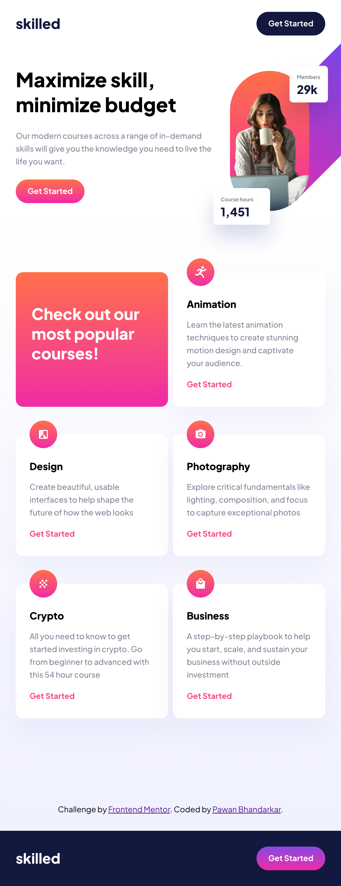

# Frontend Mentor - Skilled e-learning landing page solution

This is a solution to the [Skilled e-learning landing page challenge on Frontend Mentor](https://www.frontendmentor.io/challenges/skilled-elearning-landing-page-S1ObDrZ8q). Frontend Mentor challenges help you improve your coding skills by building realistic projects.

## Table of contents

- [Frontend Mentor - Skilled e-learning landing page solution](#frontend-mentor---skilled-e-learning-landing-page-solution)
	- [Table of contents](#table-of-contents)
	- [Overview](#overview)
		- [The challenge](#the-challenge)
		- [Screenshot](#screenshot)
			- [Desktop](#desktop)
			- [Tablet](#tablet)
			- [Mobile](#mobile)
		- [Links](#links)
		- [Built with](#built-with)
		- [What I learned](#what-i-learned)
		- [Continued development](#continued-development)
		- [Useful resources](#useful-resources)
	- [Author](#author)

## Overview

My goal in this project was to practice the CSS I had recently leanred in an online course, in the context of  React and Styled Components. This felt like a logical next step from my [last project](https://github.com/BhandarkarPawan/product-preview-card-component), which was built purely using HTML and CSS. 

### The challenge

Users should be able to:

- View the optimal layout depending on their device's screen size
- See hover states for interactive elements

### Screenshot

#### Desktop 

#### Tablet

#### Mobile

### Links

- Solution URL: [Add solution URL here](https://www.frontendmentor.io/challenges/skilled-elearning-landing-page-S1ObDrZ8q/hub/responsive-learning-with-react-Gz5In7uSpg)
- Live Site URL: [Add live site URL here](https://bhandarkar-elearning.netlify.app/)

### Built with

- Semantic HTML5 markup
- CSS custom properties
- Flexbox
- CSS Grid
- Desktop-first workflow
- [React](https://reactjs.org/) - JS library
- [Styled Components](https://styled-components.com/) - For styles

### What I learned

The biggest challenege I faced was learning how to make the image responsive on all screen sizes, while also avoiding overlap with the header. I ended up using the `<picture>` component with sources that get resolved based on the screen size. 

This code can be found in [Image.js](./src/components/Image/Image.js)

### Continued development
I am always looking for feedback on how to improve~

### Useful resources

- [Changing Image src based on window size](https://stackoverflow.com/questions/30460681/changing-image-src-depending-on-screen-size) - This helped me avoid using multiple `img` tags. At first, I was using `display:none` and `display:block` based on the media queries. This helped me simplify things. 

## Author
@AndyBlake1106@gmail.com

